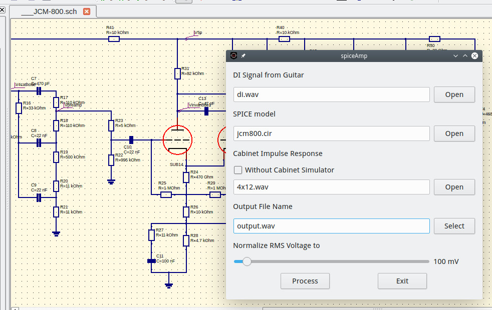

spiceAmp
========

Non-realtime high realistic software guitar processor. Works with \*.wav files as input and output. It uses <a href="http://ngspice.sourceforge.net/">ngspice</a> for electric circuit simulation and FFT convolver with Impulse Response *.wav file for cabinet simulation.

Project ships with SPICE sub-models of Valves used in guitar amplifiers and several examples of pedal and amplifier models.

**See *~/spiceAmp Data/Models* in your HOME directory!**

You see [Qucs-S](https://ra3xdh.github.io/) in the background of this screen. *spiceAmp* is a small dialog window :)

### Features

  * Check the sound of any guitar pedal or guitar amplifier circuit, for emulator or hardware development.
  * Research how the circuit works with sound.
  * Create profiles for tubeAmp guitar processor without real hardware.

# Dependencies for using AppImage binary version

  * *ngspice* applicaton MUST be in your PATH.
  * SPICE schematic editor, [Qucs-S](https://ra3xdh.github.io/) recommended.

# Dependencies for building

  * g++ compiler.
  * Meson build system.
  * Zita-resampler 1.6 development files.
  * Qt5 framework development files.
  * fftw3 development files.
  * GSL development files.

In Ubuntu run:

`apt install g++ qtbase5-dev qtchooser libgsl-dev libfftw3-dev libzita-resampler-dev meson`

# How to build and install

Project uses meson build system.

  * Run `meson build` and then `ninja -C build` in the source directory.
  * Run `ninja -C build install` to install to /usr/local/*.

To install to */usr*, run

  * `meson build --reconfigure --prefix /usr` and then
  * `ninja -C build install`.

### Quick start guides

[English](https://kpp-tubeamp.com/guides)

## Development

GUI and support code is written in C++ with Qt Framework.

## License

GPLv3+.
